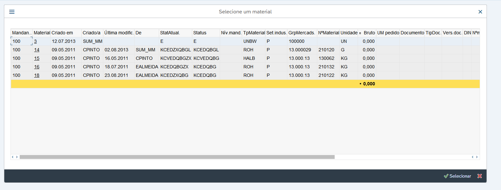
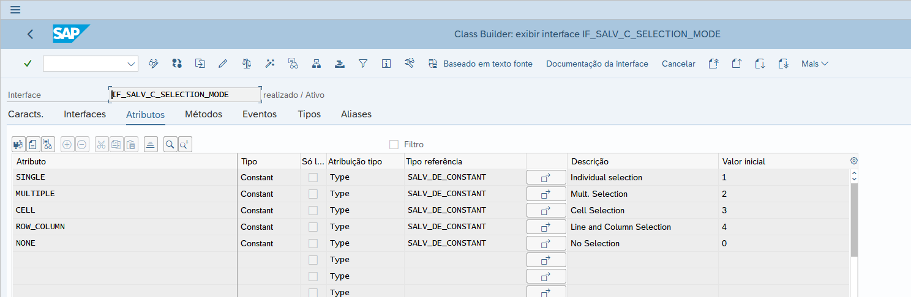

# Cria ALV pop-up de qualquer tabela
 Função que possibilita importar qualquer tabela com uma estrutura criada na SE11 e exibi-la em formato de pop-up para que o usuário escolha um registro.
 
 
 
[Link programa de exemplo utilizando a função](src/zalvpopup_exemplo.prog.abap)
 
 
 ## Opções da função:
 - Retorna todas as linhas selecionadas pelo usuário
 - Opção de marcar colunas com hotspot
 - Opção de marcar colunas para exibir total
 - Opção de escolher o modo de seleção (unica linha/várias linhas)
 - Opção de informar a dimensão desejada da tela
 - Opção de informar o título.
 
 ### Parâmetros de importação da função:
| Parâmetro | Descrição |
| --- | --- |
| I_TABLE_DATA | Informar qualquer tabela com valores |
| I_STRUCTURE | Informar a estrutura da tabela |
| I_IGNORING_FIELDS | Informar campos da estrutura que não devem ser exibidos |
| I_HOTSPOT | Informar campos para hotspot |
| I_TOTALROW | Informar campos que serão totalizados no ALV |
| I_SELECTION_MODE | Modo de exibição |
| I_DIMENSION | Informar as dimensões |
| I_TITLE | Informar o título |

### Parâmetros de retorno da função:
| Parâmetro | Descrição |
| --- | --- |
| E_SELECTED_ROWS | Retorna linhas selecionadas pelo usuário |

## Exemplos de uso
### Hotspot
| Campo | Descrição |
| --- | --- |
| TCODE | Transação que será chamada ao ser clicado o link do ALV |
| FIELD | Campo que ficará com o link para acessar outra transação no ALV |
| SUBFIELD | Sub campo que compõe o acesso a transação mas não terá link exibido no ALV |
| PARAMETERS | Parâmetro do campo na transação |

Exemplo tabela preenchida para exibir arquivo DMS (CV03N):
| TCODE | FIELD | SUBFIELD | PARAMETERS |
| --- | --- | --- | --- |
| CV03N | DOKNR | DOKNR | CV1 |
| CV03N | DOKNR | DOKAR | CV2 |
| CV03N | DOKNR | DOKVR | CV3 |
| CV03N | DOKNR | DOKTL | CV4 |

### Selection_mode
Passar qualquer atributo da interface IF_SALV_C_SELECTION_MODE:

 
 

